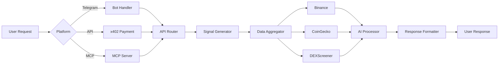

# How It Works

Syra is built as a **modular intelligence layer** that combines multiple data sources, AI reasoning, and flexible delivery platforms. This page explains the architecture, data flow, and key components that power Syra's trading intelligence.

## Architecture Overview

<Steps>
  <Step title="Data Ingestion">
    Syra continuously ingests data from multiple sources:
    - Market data from Binance, CoinGecko, DEXScreener
    - On-chain data from Nansen and Solana RPC nodes
    - Social sentiment from X/Twitter and news aggregators
    - Risk data from Rugcheck and Bubblemaps
  </Step>
  
  <Step title="AI Processing">
    Data is processed through AI reasoning layers:
    - Technical indicator calculation (RSI, MACD, etc.)
    - Sentiment analysis on news and social data
    - Pattern recognition for smart money behavior
    - Signal generation with confidence scoring
  </Step>
  
  <Step title="Intelligence Synthesis">
    Multiple signals are combined into actionable insights:
    - Cross-validation across data sources
    - Risk-aware perspective generation
    - Structured research with cited sources
    - Confidence levels and scenario analysis
  </Step>
  
  <Step title="Multi-Platform Delivery">
    Intelligence is delivered through multiple channels:
    - Telegram bot for chat-based access
    - REST API with x402 pay-per-use
    - MCP server for AI assistant integration
    - Autonomous agent workflows on x402scan
  </Step>
</Steps>

## System Components

### Backend API

The core API (`/api`) powers all intelligence endpoints:

<CodeGroup>
```javascript API Structure
// Signal generation endpoint
router.get('/signal', requirePayment, async (req, res) => {
  const token = req.query.token || 'bitcoin';
  const signal = await generateSignal(token);
  res.json({ signal });
});
```

```javascript Data Aggregation
// Multi-source price aggregation
const price = await aggregatePriceData([
  binanceAPI.getPrice(symbol),
  coingeckoAPI.getPrice(symbol),
  dexscreenerAPI.getPrice(symbol)
]);
```
</CodeGroup>

**Key Features:**
- Express.js REST API with x402 payment middleware
- MongoDB for data storage and caching
- n8n webhook integration for AI processing
- Multi-source data aggregation with fallbacks

### Data Sources Integration

<Tabs>
  <Tab title="Market Data">
    **Binance API**
    - Price feeds for major cryptocurrencies
    - Volume and OHLC data
    - Correlation matrix calculations
    - 1m, 5m, 15m, 1h, 4h, 1d intervals

    **CoinGecko API**
    - Simple price endpoint for quick quotes
    - On-chain token data (Solana, Base, Ethereum)
    - Pool search and trending pools
    - Market cap and volume metrics

    **DEXScreener**
    - Token profiles and community takeovers
    - TVL tracking across DEXs
    - Boosted tokens and promotions
    - Real-time DEX analytics
  </Tab>
  
  <Tab title="On-Chain Data">
    **Nansen Integration**
    - Smart money wallet tracking
    - Token God Mode (TGM) for deep analysis
    - Holder flow intelligence
    - DEX trade tracking
    - PNL leaderboards

    **Solana RPC**
    - Direct blockchain queries
    - Transaction monitoring
    - Account state tracking
    - Token holder analysis

    **Bubblemaps**
    - Holder concentration visualization
    - Whale wallet identification
    - Distribution pattern analysis
  </Tab>
  
  <Tab title="Risk & Safety">
    **Rugcheck API**
    - Token risk scoring (0-100)
    - Contract security analysis
    - New token monitoring
    - Trending and verified token lists
    - Risk alerts for high-risk tokens

    **Risk Analysis Engine**
    - Multi-factor risk scoring
    - Historical pattern matching
    - Liquidity depth analysis
    - Developer history verification
  </Tab>
  
  <Tab title="Social & News">
    **EXA AI Search**
    - Advanced web search capabilities
    - Context-aware information retrieval
    - Source credibility scoring

    **X/Twitter Monitoring**
    - KOL mention tracking
    - Sentiment analysis on tweets
    - Trending topic detection
    - Smart money social activity

    **News Aggregation**
    - Multi-source crypto news
    - Credibility-weighted scoring
    - Event calendar integration
    - Impact analysis
  </Tab>
</Tabs>

### AI Reasoning Layer

Syra uses AI at multiple stages:

<AccordionGroup>
  <Accordion title="Signal Generation">
    **How signals are generated:**

    1. **Data Collection** — Gather technical indicators, volume, price action
    2. **Pattern Recognition** — Identify chart patterns and setups
    3. **Risk Calculation** — Determine optimal entry, targets, stop-loss
    4. **Confidence Scoring** — AI assigns confidence level (0-100%)
    5. **Explanation Generation** — Natural language explanation of reasoning

    ```json
    {
      "recommendation": "BUY",
      "entryPrice": "$67,200",
      "targets": ["$69,500", "$72,000", "$75,800"],
      "stopLoss": "$65,100",
      "confidence": 78,
      "reasoning": "Strong bullish divergence on RSI with volume confirmation..."
    }
    ```
  </Accordion>
  
  <Accordion title="Research Synthesis">
    **Deep research workflow:**

    1. **Query Analysis** — Understand user intent and scope
    2. **Source Discovery** — Search across web, news, social media
    3. **Information Extraction** — Pull relevant data from sources
    4. **Cross-Validation** — Verify facts across multiple sources
    5. **Synthesis** — Combine into coherent narrative with citations

    Uses Jatevo AI models (Claude, GPT-4) via n8n workflows.
  </Accordion>
  
  <Accordion title="Sentiment Analysis">
    **Natural language processing for sentiment:**

    - News headline sentiment scoring
    - Social media post classification (bullish/bearish/neutral)
    - KOL influence weighting
    - Temporal sentiment trend analysis
    - Confidence-weighted aggregation
  </Accordion>
  
  <Accordion title="Smart Money Detection">
    **Machine learning for wallet classification:**

    - Historical performance analysis
    - Trading pattern recognition
    - Portfolio composition analysis
    - Timing and execution quality scoring
    - Continuous model retraining
  </Accordion>
</AccordionGroup>

## Data Flow

Here's how a typical signal request flows through the system:



<Note>
  All API requests go through x402 payment verification (except dev routes). This ensures fair usage and sustainable operation.
</Note>

## Payment & Pricing (x402)

Syra uses the **x402 protocol** for pay-per-use API access:

### How x402 Works

<Steps>
  <Step title="Discovery">
    Agents discover Syra on x402scan directory with endpoint descriptions and pricing.
  </Step>
  
  <Step title="Request">
    Agent makes API request to Syra endpoint (e.g., `/signal?token=bitcoin`).
  </Step>
  
  <Step title="Payment Challenge">
    If no valid payment, Syra returns `402 Payment Required` with payment instructions.
  </Step>
  
  <Step title="Payment Settlement">
    Agent sends USDC payment via x402 protocol and retries request.
  </Step>
  
  <Step title="Response">
    Syra validates payment and returns requested data.
  </Step>
</Steps>

### Pricing Examples

| Endpoint | Cost (USDC) | Description |
|----------|-------------|-------------|
| `/news` | $0.01 | Latest crypto news by ticker |
| `/signal` | $0.10 | AI-generated trading signal |
| `/research?type=quick` | $0.50 | Quick research on topic |
| `/research?type=deep` | $5.00 | Deep research with citations |
| `/token-god-mode` | $10.00 | Nansen token god mode (high cost due to Nansen API) |

<Info>
  80% of x402 fees go to SYRA buyback & burn. 50% of revenue also funds buyback & burn, creating deflationary pressure.
</Info>

## Platforms & Interfaces

### Telegram Bot

**Architecture:**
- Telegram Bot API integration
- Command parser and natural language understanding
- Session management and user preferences
- Response formatting for mobile readability

**Key Features:**
- `/signal <token>` — Get trading signals
- `/news <ticker>` — Latest news
- `/list` — Supported tokens
- Natural language queries

### x402 Autonomous Agent

**How it works:**
- Registered on x402scan as discoverable agent
- Exposes all endpoints with pricing and schemas
- Autonomous agents can discover and pay for intelligence
- Runs automated research cycles and monitoring

**Use Cases:**
- Automated market analysis
- News and narrative monitoring
- Signal interpretation pipelines
- Cross-agent intelligence sharing

### MCP Server

**Architecture:**
- Model Context Protocol (MCP) implementation
- Stdio transport for AI assistant integration
- 30+ tools exposing Syra APIs
- Compatible with Cursor, Claude Desktop, etc.

**Workflow:**
1. AI assistant spawns MCP server process
2. User asks: "What's the latest Bitcoin analysis?"
3. AI calls `syra_v2_signal` tool with `{token: "bitcoin"}`
4. MCP server makes HTTP request to Syra API
5. Response returned to AI for natural language presentation

### API Playground

**Features:**
- Interactive API explorer
- Privy wallet integration (Solana + Base + email/social)
- x402 payment handling
- Request/response examples
- API key management

## Technology Stack

<CardGroup cols={2}>
  <Card title="Backend" icon="server">
    - **Runtime:** Node.js
    - **Framework:** Express.js
    - **Database:** MongoDB
    - **Payment:** x402 protocol
    - **AI:** Jatevo (Claude, GPT-4)
  </Card>
  
  <Card title="Frontend" icon="browser">
    - **Framework:** Next.js 16
    - **UI:** React 19, Tailwind CSS
    - **Wallet:** Privy (multi-chain)
    - **Hosting:** Vercel
  </Card>
  
  <Card title="Blockchain" icon="link">
    - **Primary:** Solana
    - **Token:** SPL Token ($SYRA)
    - **Payment:** x402 (USDC)
    - **DEX:** Jupiter integration
  </Card>
  
  <Card title="Automation" icon="robot">
    - **Workflows:** n8n
    - **AI Processing:** Claude via n8n
    - **Scheduling:** Cron jobs
    - **Monitoring:** Uptime checks
  </Card>
</CardGroup>

## Scalability & Performance

### Caching Strategy

- **Market data:** 1-5 minute cache for price/volume
- **News/events:** 15-30 minute cache
- **Research:** 1-hour cache for identical queries
- **Token statistics:** 5-minute cache

### Rate Limiting

- **Free tier:** 10 requests/minute
- **Paid (x402):** No hard limits, pay-per-use
- **API keys:** Custom rate limits

### Infrastructure

- API hosted on scalable cloud infrastructure
- MongoDB for flexible data storage
- CDN for static assets
- Load balancing for high availability

<Warning>
  During high market volatility, some third-party APIs (Nansen, Rugcheck) may experience delays. Syra implements timeout handling and fallbacks.
</Warning>

## Development & Testing

### Local Development

Run Syra locally with dev routes (no payment required):

```bash
# Start API server
cd api
npm run dev

# API runs on http://localhost:3000
# Dev routes: /signal/dev, /news/dev, etc.
```

### Testing Tools

- **API Playground:** Interactive testing with wallet connection
- **MCP Server:** Test with `SYRA_USE_DEV_ROUTES=true`
- **Postman Collection:** Available for API testing

## Security & Privacy

<AccordionGroup>
  <Accordion title="API Security">
    - x402 payment verification on all paid endpoints
    - Rate limiting to prevent abuse
    - CORS configuration for browser security
    - Helmet.js for HTTP security headers
    - Input validation and sanitization
  </Accordion>
  
  <Accordion title="Wallet Security">
    - Non-custodial agent wallets
    - TweetNaCl for cryptographic operations
    - Secure key storage (environment variables)
    - No private keys in code or logs
  </Accordion>
  
  <Accordion title="Data Privacy">
    - No PII collection without consent
    - API request logs anonymized
    - Telegram user IDs hashed
    - GDPR-compliant data handling
  </Accordion>
</AccordionGroup>

## Next Steps

<CardGroup cols={2}>
  <Card title="Use Cases" icon="lightbulb" href="/use-cases/traders">
    See how different users leverage this architecture.
  </Card>
  
  <Card title="API Reference" icon="code" href="/api-reference/overview">
    Dive into the technical API documentation.
  </Card>
  
  <Card title="Integration Guide" icon="plug" href="/integrations/x402">
    Learn how to integrate Syra into your workflows.
  </Card>
  
  <Card title="Tokenomics" icon="coins" href="/tokenomics">
    Understand the economics behind x402 payments.
  </Card>
</CardGroup>
