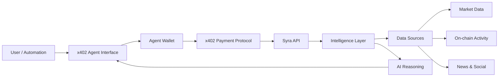

## Overview

Syra runs as an **autonomous research agent** on [x402scan](https://x402scan.com), enabling automated research cycles, news and narrative monitoring, and signal interpretation pipelines. The x402 agent operates independently to continuously analyze market conditions and generate insights.

**Agent URL:** [https://agent.syraa.fun](https://agent.syraa.fun)

## What is x402?

x402 is a **pay-per-use protocol** for API access and autonomous agent operations on Solana. It enables:

- **Micropayments** for API calls using Solana tokens
- **Automated payments** from agent wallets
- **Agent marketplaces** where AI agents can discover and use services
- **Transparent billing** with on-chain payment verification

## Syra x402 Agent Capabilities

The Syra autonomous agent on x402scan provides:

### Research & Insights Workflows

- **Automated Research Cycles** — Continuously monitors and analyzes market conditions
- **News & Narrative Monitoring** — Tracks breaking news and emerging narratives across crypto
- **Signal Interpretation Pipelines** — Processes trading signals and contextualizes them
- **Multi-source Intelligence** — Aggregates data from X/Twitter, DEXs, on-chain activity, and news sources

### Integration Points

<CardGroup cols={2}>
  <Card title="Market Intelligence" icon="chart-line">
    Real-time technical indicators, price action, and volume analysis
  </Card>
  <Card title="On-chain Analysis" icon="link">
    Holder flows, smart money tracking, and DEX activity signals
  </Card>
  <Card title="Sentiment Detection" icon="brain">
    News aggregation, social trends, and market mood interpretation
  </Card>
  <Card title="AI Reasoning" icon="robot">
    Structured research output with confidence levels and cited sources
  </Card>
</CardGroup>

## How It Works

<Steps>
  <Step title="Agent Discovery">
    Users find Syra on x402scan marketplace or directly at [agent.syraa.fun](https://agent.syraa.fun)
  </Step>
  
  <Step title="Wallet Connection">
    Connect a Solana wallet to enable automated payments for agent operations
  </Step>
  
  <Step title="Research Request">
    Submit a research query, token analysis request, or configure automated monitoring
  </Step>
  
  <Step title="Automated Execution">
    The agent autonomously:
    - Calls Syra API endpoints
    - Aggregates multi-source data
    - Processes through AI reasoning layer
    - Delivers structured insights
  </Step>
  
  <Step title="Payment Settlement">
    x402 handles micropayments automatically from your agent wallet to Syra services
  </Step>
</Steps>

## Use Cases

### 1. Continuous Market Monitoring

Set up the agent to monitor specific tokens or market conditions:

- Track sentiment shifts for SOL, BTC, ETH
- Alert on unusual whale behavior in memecoins
- Monitor smart money accumulation patterns

### 2. Narrative Research

Automated deep-dive research on emerging narratives:

- "Research Solana DeFi trends in Q1 2026"
- "Analyze sentiment around upcoming ETF decisions"
- "Track KOL discussions about AI agent tokens"

### 3. Signal Interpretation

Process trading signals with multi-layered context:

- Combine technical signals with on-chain data
- Cross-reference news events with price action
- Generate risk-aware trade perspectives

### 4. Automated Reporting

Scheduled intelligence reports:

- Daily sundown digest delivery
- Weekly memecoin screening summaries
- Event-driven alert workflows

## x402 Agent Features

### AI Chat Interface

- **Conversational AI** — Ask questions in natural language
- **Shareable Sessions** — Share chat sessions via URL
- **Context Retention** — Agent remembers conversation history

### Marketplace Integration

- **Service Discovery** — Browse available Syra tools and workflows
- **Pay-per-use** — Only pay for the API calls you make
- **Transparent Pricing** — See costs before executing operations

### Wallet & Payment

- **Solana Wallet Adapter** — Connect Phantom, Solflare, etc.
- **Automated Payments** — Agent wallet handles x402 micropayments
- **Payment History** — Track all transactions on-chain

## Architecture



## Agent Configuration

The x402 agent uses the same backend API as all Syra integrations:

**API Endpoint:** `https://api.syraa.fun`

**Payment Protocol:** x402 (Solana)

**Services Exposed:**
- Trading signals (`/signal`)
- Research & browse (`/research`, `/browse`, `/x-search`)
- Token analysis (`/token-report`, `/token-god-mode`)
- Market data (`/news`, `/event`, `/sentiment`)
- Analytics (`/analytics/summary`, `/smart-money`)
- Memecoin screens (`/memecoin/*`)

## Setting Up Your Own x402 Agent

To deploy Syra as an x402 agent in your own environment:

<Steps>
  <Step title="Clone the Repository">
    Get the Syra monorepo:
    
    ```bash
    git clone https://github.com/your-org/syra-monorepo
    cd ai-agent
    ```
  </Step>
  
  <Step title="Install Dependencies">
    ```bash
    npm install
    ```
  </Step>
  
  <Step title="Configure Environment">
    Set up your `.env` file:
    
    ```env
    VITE_API_BASE_URL=https://api.syraa.fun
    VITE_X402_ENABLED=true
    # Add Solana wallet configuration
    ```
  </Step>
  
  <Step title="Build and Deploy">
    ```bash
    npm run build
    npm run preview
    ```
    
    Or deploy to Vercel using the included `vercel.json`.
  </Step>
</Steps>

## Tech Stack

| Layer | Technology |
|-------|------------|
| **Build** | Vite, TypeScript |
| **UI** | React, shadcn-ui, Tailwind CSS, Radix UI |
| **Wallet** | Privy (Solana + Base + email/social) |
| **Payment** | @x402/core, @x402/evm |
| **Testing** | Vitest, Testing Library |

## x402 Payment Flow

<Steps>
  <Step title="Service Discovery">
    Agent discovers Syra services with pricing metadata
  </Step>
  
  <Step title="Request Initiation">
    User/automation triggers API call (e.g., `/signal bitcoin`)
  </Step>
  
  <Step title="Payment Requirement">
    API returns **402 Payment Required** with payment details
  </Step>
  
  <Step title="Automated Payment">
    Agent wallet signs and sends payment transaction on Solana
  </Step>
  
  <Step title="Payment Verification">
    API verifies payment signature and on-chain transaction
  </Step>
  
  <Step title="Service Delivery">
    API returns requested data with **200 OK** response
  </Step>
</Steps>

## Integration with Syra Ecosystem

The x402 agent shares the same intelligence layer as:

- [Telegram Bot](/integrations/telegram) — Chat-based access
- [MCP Server](/integrations/mcp-server) — Cursor/Claude Desktop integration
- [API Playground](/integrations/api-playground) — Manual API testing
- [8004 Registry](/integrations/8004-registry) — Solana agent discovery

## Benefits of x402 Agent Architecture

<CardGroup cols={2}>
  <Card title="Autonomous Operation" icon="gear">
    Runs independently without manual intervention
  </Card>
  <Card title="Pay-per-Use" icon="dollar-sign">
    Only pay for actual API calls, no subscriptions
  </Card>
  <Card title="Transparent Costs" icon="eye">
    All payments tracked on-chain
  </Card>
  <Card title="Composable Services" icon="puzzle-piece">
    Mix and match Syra tools for custom workflows
  </Card>
</CardGroup>

## Example Agent Workflows

### Daily Morning Brief

```typescript
// Automated morning research cycle
const morningBrief = async () => {
  const digest = await agent.call('syra_v2_sundown_digest');
  const btcSignal = await agent.call('syra_v2_signal', { token: 'bitcoin' });
  const news = await agent.call('syra_v2_news', { ticker: 'general' });
  const gems = await agent.call('syra_v2_gems');
  
  return aggregateInsights([digest, btcSignal, news, gems]);
};
```

### Memecoin Screening

```typescript
// Scan for high-potential memecoins
const screenMemecoins = async () => {
  const fastGrowth = await agent.call('syra_v2_memecoin_fastest_holder_growth');
  const smartMoney = await agent.call('syra_v2_memecoin_most_mentioned_smart_money_x');
  const narrative = await agent.call('syra_v2_memecoin_strong_narrative_low_mcap');
  
  return findOverlaps([fastGrowth, smartMoney, narrative]);
};
```

## Monitoring & Analytics

- **Agent Health:** Check status at `/check-status`
- **Usage Metrics:** Track API calls and payments on-chain
- **Performance:** Monitor response times and success rates

## Next Steps

<CardGroup cols={2}>
  <Card title="API Playground" icon="flask" href="/integrations/api-playground">
    Test x402 payments manually
  </Card>
  <Card title="8004 Registry" icon="database" href="/integrations/8004-registry">
    Register your agent on Solana
  </Card>
  <Card title="n8n Workflows" icon="workflow" href="/integrations/n8n-workflows">
    Automate with n8n
  </Card>
  <Card title="API Reference" icon="code" href="/api-reference">
    Full endpoint documentation
  </Card>
</CardGroup>