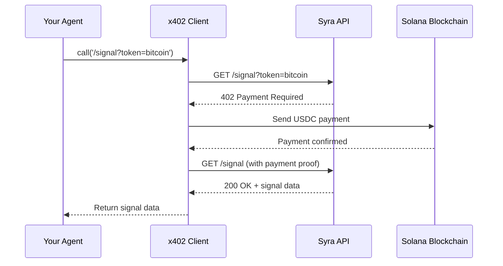

# Syra for Developers

Developers use Syra to build trading bots, autonomous agents, portfolio trackers, and custom crypto applications. Syra provides REST APIs, x402 integration, and MCP server support for flexible integration.

## Getting Started

<Tabs>
  <Tab title="REST API">
    **Direct HTTP Access**

    Quickest way to integrate Syra:

    ```bash
    # Get trading signal
    curl https://api.syraa.fun/signal?token=bitcoin

    # Get latest news
    curl https://api.syraa.fun/news?ticker=BTC

    # Get analytics summary
    curl https://api.syraa.fun/analytics/summary
    ```

    <Info>
      Production API requires x402 payment. See [x402 Integration](#x402-integration) below.
    </Info>

    **For Local Development:**
    ```bash
    # Clone the repo
    git clone <syra-monorepo>
    cd api

    # Install and run
    npm install
    npm run dev

    # API runs on http://localhost:3000
    # Dev routes (no payment): /signal/dev, /news/dev, etc.
    ```
  </Tab>
  
  <Tab title="x402 SDK">
    **Pay-Per-Use Integration**

    Use x402 protocol for autonomous agent integration:

    ```javascript
    import { X402Client } from '@x402/core';

    const client = new X402Client({
      agentWallet: yourSolanaWallet,
      network: 'mainnet'
    });

    // Discover Syra on x402scan
    const syra = await client.discoverAgent('syra');

    // Call endpoint (payment handled automatically)
    const signal = await client.call({
      agent: syra,
      endpoint: '/signal',
      params: { token: 'bitcoin' }
    });

    console.log(signal);
    ```

    <Tip>
      x402 is perfect for autonomous agents that need to pay for API calls without manual intervention.
    </Tip>
  </Tab>
  
  <Tab title="MCP Server">
    **AI Assistant Integration**

    Use Syra in Cursor, Claude Desktop, or custom AI assistants:

    ```bash
    cd mcp-server
    npm install
    npm run build
    ```

    **Add to MCP Config:**
    ```json
    {
      "mcpServers": {
        "syra": {
          "command": "node",
          "args": ["/path/to/mcp-server/dist/index.js"],
          "env": {
            "SYRA_API_BASE_URL": "https://api.syraa.fun"
          }
        }
      }
    }
    ```

    **Usage in AI Chat:**
    - "Get Bitcoin trading signal"
    - "What's the latest crypto news?"
    - "Research Solana DeFi ecosystem"
  </Tab>
</Tabs>

## API Integration Examples

### Trading Bot Example

Build a simple trading bot using Syra signals:

```javascript
import axios from 'axios';
import { Connection, PublicKey } from '@solana/web3.js';
import { Jupiter } from '@jup-ag/core';

// Configuration
const SYRA_API = 'https://api.syraa.fun';
const CHECK_INTERVAL = 60000; // 1 minute

class TradingBot {
  constructor(wallet, tokens) {
    this.wallet = wallet;
    this.tokens = tokens; // ['bitcoin', 'solana', 'ethereum']
    this.positions = {};
  }

  async getSignal(token) {
    try {
      const response = await axios.get(`${SYRA_API}/signal`, {
        params: { token },
        headers: {
          // Add x402 payment headers here
        }
      });
      return response.data.signal;
    } catch (error) {
      console.error(`Error fetching signal for ${token}:`, error);
      return null;
    }
  }

  async checkSignals() {
    for (const token of this.tokens) {
      const signal = await this.getSignal(token);
      
      if (!signal) continue;

      // Only act on high-confidence signals (>70%)
      if (signal.confidence > 70) {
        await this.processSignal(token, signal);
      }
    }
  }

  async processSignal(token, signal) {
    const currentPosition = this.positions[token];

    // BUY signal and no current position
    if (signal.recommendation === 'BUY' && !currentPosition) {
      console.log(`BUY signal for ${token} at ${signal.entryPrice}`);
      await this.executeBuy(token, signal);
    }

    // SELL signal and have position
    if (signal.recommendation === 'SELL' && currentPosition) {
      console.log(`SELL signal for ${token}`);
      await this.executeSell(token, signal);
    }

    // Check stop-loss and take-profit for existing positions
    if (currentPosition) {
      await this.checkExitConditions(token, currentPosition, signal);
    }
  }

  async executeBuy(token, signal) {
    // Calculate position size (2% of portfolio)
    const portfolioValue = await this.getPortfolioValue();
    const riskAmount = portfolioValue * 0.02;
    const entryPrice = parseFloat(signal.entryPrice.replace(/[$,]/g, ''));
    const stopLoss = parseFloat(signal.stopLoss.replace(/[$,]/g, ''));
    const positionSize = riskAmount / (entryPrice - stopLoss);

    // Execute buy via Jupiter (Solana DEX)
    // Implementation details...
    
    this.positions[token] = {
      entryPrice,
      stopLoss,
      targets: signal.targets,
      size: positionSize,
      entryTime: Date.now()
    };
  }

  async executeSell(token, signal) {
    // Execute sell via Jupiter
    // Implementation details...
    
    delete this.positions[token];
  }

  async checkExitConditions(token, position, signal) {
    const currentPrice = await this.getCurrentPrice(token);

    // Stop-loss hit
    if (currentPrice <= position.stopLoss) {
      console.log(`Stop-loss hit for ${token}`);
      await this.executeSell(token, signal);
      return;
    }

    // Take-profit targets
    for (let i = 0; i < position.targets.length; i++) {
      const target = parseFloat(position.targets[i].replace(/[$,]/g, ''));
      if (currentPrice >= target && !position[`tp${i+1}Hit`]) {
        console.log(`TP${i+1} hit for ${token}`);
        // Sell portion of position
        await this.executePartialSell(token, 0.33); // Sell 33%
        position[`tp${i+1}Hit`] = true;
      }
    }
  }

  async run() {
    console.log('Trading bot started...');
    setInterval(() => this.checkSignals(), CHECK_INTERVAL);
  }
}

// Initialize and run
const bot = new TradingBot(myWallet, ['bitcoin', 'solana', 'ethereum']);
bot.run();
```

<Warning>
  This is a simplified example. Production trading bots require extensive error handling, risk management, and testing.
</Warning>

### Portfolio Tracker Example

Monitor portfolio with smart money insights:

```javascript
import axios from 'axios';

class PortfolioTracker {
  constructor(holdings) {
    this.holdings = holdings; // { 'SOL': 100, 'BTC': 0.5, ... }
  }

  async getPortfolioAnalysis() {
    const analysis = {
      positions: [],
      totalValue: 0,
      smartMoneyAlignment: {},
      riskScores: {},
      correlationRisk: 0
    };

    // Get current prices
    const prices = await this.getCurrentPrices();

    // Analyze each position
    for (const [token, amount] of Object.entries(this.holdings)) {
      const positionAnalysis = await this.analyzePosition(token, amount, prices[token]);
      analysis.positions.push(positionAnalysis);
      analysis.totalValue += positionAnalysis.value;
    }

    // Get smart money data
    const smartMoney = await axios.get('https://api.syraa.fun/smart-money');
    analysis.smartMoneyAlignment = this.compareWithSmartMoney(smartMoney.data);

    // Get correlation matrix
    const correlation = await axios.get('https://api.syraa.fun/binance/correlation-matrix');
    analysis.correlationRisk = this.calculateCorrelationRisk(correlation.data);

    return analysis;
  }

  async analyzePosition(token, amount, price) {
    // Get signal for position
    const signal = await axios.get(`https://api.syraa.fun/signal?token=${token}`);
    
    // Get risk score (for Solana tokens)
    let riskScore = null;
    if (token.includes('SOL-')) {
      const tokenAddress = this.getTokenAddress(token);
      const rugcheck = await axios.get(`https://api.syraa.fun/token-report?address=${tokenAddress}`);
      riskScore = rugcheck.data.score;
    }

    return {
      token,
      amount,
      price,
      value: amount * price,
      signal: signal.data.signal,
      riskScore,
      recommendation: this.getRecommendation(signal.data.signal, riskScore)
    };
  }

  getRecommendation(signal, riskScore) {
    // High risk score = SELL
    if (riskScore && riskScore > 50) return 'SELL - High Risk';
    
    // Follow signal if high confidence
    if (signal.confidence > 70) return signal.recommendation;
    
    // Default to HOLD
    return 'HOLD';
  }

  async generateReport() {
    const analysis = await this.getPortfolioAnalysis();
    
    console.log('\n=== Portfolio Analysis ===');
    console.log(`Total Value: $${analysis.totalValue.toFixed(2)}`);
    console.log(`\nPositions:`);
    
    for (const position of analysis.positions) {
      console.log(`\n${position.token}:`);
      console.log(`  Value: $${position.value.toFixed(2)} (${position.amount} @ $${position.price})`);
      console.log(`  Signal: ${position.signal.recommendation} (${position.signal.confidence}% confidence)`);
      if (position.riskScore) {
        console.log(`  Risk Score: ${position.riskScore}`);
      }
      console.log(`  Recommendation: ${position.recommendation}`);
    }
    
    console.log(`\nSmart Money Alignment:`, analysis.smartMoneyAlignment);
    console.log(`Correlation Risk: ${analysis.correlationRisk.toFixed(2)}`);
  }
}

// Usage
const portfolio = new PortfolioTracker({
  'SOL': 100,
  'BTC': 0.5,
  'ETH': 3.2
});

portfolio.generateReport();
```

## x402 Integration

Integrate x402 for autonomous, pay-per-use API access:

### Setup x402 Client

<Steps>
  <Step title="Install Dependencies">
    ```bash
    npm install @x402/core @x402/fetch @solana/web3.js
    ```
  </Step>
  
  <Step title="Create Agent Wallet">
    ```javascript
    import { Keypair } from '@solana/web3.js';
    import fs from 'fs';

    // Generate new wallet for your agent
    const wallet = Keypair.generate();
    
    // Save securely
    fs.writeFileSync(
      'agent-wallet.json',
      JSON.stringify(Array.from(wallet.secretKey))
    );

    console.log('Agent wallet:', wallet.publicKey.toString());
    // Fund this wallet with SOL and USDC for x402 payments
    ```
  </Step>
  
  <Step title="Initialize x402 Client">
    ```javascript
    import { X402Client } from '@x402/core';
    import { Connection, Keypair } from '@solana/web3.js';
    import fs from 'fs';

    // Load agent wallet
    const secretKey = JSON.parse(fs.readFileSync('agent-wallet.json'));
    const wallet = Keypair.fromSecretKey(new Uint8Array(secretKey));

    // Connect to Solana
    const connection = new Connection('https://api.mainnet-beta.solana.com');

    // Initialize x402 client
    const x402 = new X402Client({
      wallet,
      connection,
      network: 'mainnet'
    });
    ```
  </Step>
  
  <Step title="Make Paid API Calls">
    ```javascript
    // Discover Syra agent
    const syraAgent = await x402.discoverAgent('syra');

    // Call endpoint (payment handled automatically)
    const response = await x402.call({
      agent: syraAgent,
      endpoint: '/signal',
      method: 'GET',
      params: { token: 'bitcoin' }
    });

    console.log('Signal:', response.data.signal);
    // Payment of ~$0.10 USDC automatically deducted
    ```
  </Step>
</Steps>

### x402 Payment Flow



### Handle x402 Errors

```javascript
try {
  const signal = await x402.call({
    agent: syraAgent,
    endpoint: '/signal',
    params: { token: 'bitcoin' }
  });
} catch (error) {
  if (error.code === 'INSUFFICIENT_FUNDS') {
    console.error('Agent wallet needs more USDC');
    // Alert operator to fund wallet
  } else if (error.code === 'PAYMENT_TIMEOUT') {
    console.error('Payment confirmation timed out');
    // Retry logic
  } else {
    console.error('Unexpected error:', error);
  }
}
```

## Automation Workflows

### n8n Integration

Automate Syra intelligence with n8n workflows:

<Accordion title="Example: Daily Market Report to Telegram">
  **Workflow Steps:**

  1. **Schedule Trigger** — Every day at 8 AM
  2. **HTTP Request** — `GET https://api.syraa.fun/sundown-digest`
  3. **HTTP Request** — `GET https://api.syraa.fun/smart-money`
  4. **HTTP Request** — `GET https://api.syraa.fun/trending-jupiter`
  5. **Function** — Format data into readable message
  6. **Telegram** — Send message to your channel

  **n8n Node Configuration:**
  ```json
  {
    "nodes": [
      {
        "type": "n8n-nodes-base.scheduleTrigger",
        "parameters": {
          "rule": { "interval": "daily", "hour": 8 }
        }
      },
      {
        "type": "n8n-nodes-base.httpRequest",
        "parameters": {
          "url": "https://api.syraa.fun/sundown-digest",
          "method": "GET"
        }
      }
    ]
  }
  ```
</Accordion>

### Webhook-Based Trading System

Receive Syra signals via webhooks:

```javascript
import express from 'express';
import { executeTradeStrategy } from './trading';

const app = express();
app.use(express.json());

// Webhook endpoint for Syra signals
app.post('/webhook/syra-signal', async (req, res) => {
  const { token, signal } = req.body;

  // Validate webhook signature
  if (!validateSignature(req)) {
    return res.status(401).send('Unauthorized');
  }

  // Only act on high-confidence signals
  if (signal.confidence > 75) {
    await executeTradeStrategy(token, signal);
  }

  res.send('OK');
});

app.listen(3000);
```

## Building Autonomous Agents

### Autonomous Research Agent

Build an agent that continuously researches and reports:

```javascript
class ResearchAgent {
  constructor(topics, reportInterval) {
    this.topics = topics;
    this.reportInterval = reportInterval;
    this.findings = [];
  }

  async research(topic) {
    // Deep research on topic
    const research = await axios.get('https://api.syraa.fun/research', {
      params: { query: topic, type: 'deep' }
    });

    // Get latest news
    const news = await axios.get('https://api.syraa.fun/news', {
      params: { ticker: topic }
    });

    // Get sentiment
    const sentiment = await axios.get('https://api.syraa.fun/sentiment', {
      params: { ticker: topic }
    });

    return {
      topic,
      research: research.data,
      news: news.data,
      sentiment: sentiment.data,
      timestamp: new Date()
    };
  }

  async run() {
    console.log('Research agent started...');
    
    // Continuous research loop
    setInterval(async () => {
      for (const topic of this.topics) {
        const finding = await this.research(topic);
        this.findings.push(finding);
        
        // Analyze for important updates
        if (this.isSignificantFinding(finding)) {
          await this.alertUser(finding);
        }
      }
      
      // Generate periodic report
      await this.generateReport();
    }, this.reportInterval);
  }

  isSignificantFinding(finding) {
    // Detect significant news or sentiment shifts
    return finding.sentiment.shift > 0.3 || 
           finding.news.some(n => n.impact === 'high');
  }

  async alertUser(finding) {
    // Send alert via Telegram, email, etc.
    console.log('ALERT:', finding.topic, '-', finding.research.summary);
  }
}

const agent = new ResearchAgent(
  ['bitcoin', 'solana', 'ethereum'],
  3600000 // 1 hour
);
agent.run();
```

## SDK Development

Build a JavaScript SDK for easier integration:

```javascript
// syra-sdk.js
import axios from 'axios';

class SyraSDK {
  constructor(apiKey, baseURL = 'https://api.syraa.fun') {
    this.apiKey = apiKey;
    this.baseURL = baseURL;
    this.client = axios.create({
      baseURL,
      headers: apiKey ? { 'X-API-Key': apiKey } : {}
    });
  }

  // Signals
  async getSignal(token = 'bitcoin') {
    const { data } = await this.client.get('/signal', { params: { token } });
    return data.signal;
  }

  // News & Events
  async getNews(ticker = 'general') {
    const { data } = await this.client.get('/news', { params: { ticker } });
    return data.news;
  }

  async getEvents(ticker = 'general') {
    const { data } = await this.client.get('/event', { params: { ticker } });
    return data.events;
  }

  // Research
  async research(query, type = 'quick') {
    const { data } = await this.client.get('/research', { params: { query, type } });
    return data;
  }

  // Smart Money
  async getSmartMoney() {
    const { data } = await this.client.get('/smart-money');
    return data;
  }

  // Token Analysis
  async getTokenReport(address) {
    const { data } = await this.client.get('/token-report', { params: { address } });
    return data;
  }

  async getTokenGodMode(tokenAddress) {
    const { data } = await this.client.get('/token-god-mode', { params: { tokenAddress } });
    return data;
  }

  // Analytics
  async getAnalyticsSummary() {
    const { data } = await this.client.get('/analytics/summary');
    return data;
  }

  // Memecoins
  async getMemecoins(screen) {
    const validScreens = [
      'fastest-holder-growth',
      'most-mentioned-by-smart-money-x',
      'accumulating-before-CEX-rumors',
      'strong-narrative-low-market-cap',
      'by-experienced-devs',
      'unusual-whale-behavior',
      'trending-on-x-not-dex',
      'organic-traction',
      'surviving-market-dumps'
    ];
    
    if (!validScreens.includes(screen)) {
      throw new Error(`Invalid screen: ${screen}`);
    }
    
    const { data } = await this.client.get(`/memecoin/${screen}`);
    return data;
  }
}

export default SyraSDK;

// Usage
import SyraSDK from './syra-sdk';

const syra = new SyraSDK('your-api-key');
const signal = await syra.getSignal('bitcoin');
const news = await syra.getNews('BTC');
const memecoins = await syra.getMemecoins('fastest-holder-growth');
```

## Testing & Development

### Local Development Setup

```bash
# Clone repo
git clone <syra-monorepo>
cd api

# Install dependencies
npm install

# Set up environment
cp .env.example .env
# Edit .env with your API keys

# Run locally
npm run dev

# API available at http://localhost:3000
# Dev routes: /signal/dev, /news/dev, etc. (no payment)
```

### Testing Tools

<CardGroup cols={2}>
  <Card title="API Playground" icon="play">
    Interactive testing at playground.syraa.fun with wallet connection.
  </Card>
  
  <Card title="MCP Dev Mode" icon="terminal">
    Test MCP server with `SYRA_USE_DEV_ROUTES=true` for free local testing.
  </Card>
  
  <Card title="Postman Collection" icon="file-code">
    Import Postman collection for all endpoints (coming soon).
  </Card>
  
  <Card title="Unit Tests" icon="vial">
    Run test suite with `npm test` in API directory.
  </Card>
</CardGroup>

## Best Practices

<AccordionGroup>
  <Accordion title="Error Handling">
    Always implement robust error handling:

    ```javascript
    async function getSafeSignal(token) {
      try {
        const signal = await syra.getSignal(token);
        return signal;
      } catch (error) {
        if (error.response?.status === 402) {
          console.error('Payment required - fund agent wallet');
        } else if (error.response?.status === 429) {
          console.error('Rate limited - slow down requests');
        } else if (error.code === 'ECONNREFUSED') {
          console.error('API unreachable - check network');
        } else {
          console.error('Unexpected error:', error.message);
        }
        return null;
      }
    }
    ```
  </Accordion>
  
  <Accordion title="Rate Limiting">
    Respect rate limits to avoid throttling:

    - Free tier: 10 requests/minute
    - Implement exponential backoff on errors
    - Cache responses when appropriate
    - Use x402 for higher limits
  </Accordion>
  
  <Accordion title="Caching">
    Cache responses to reduce costs and improve performance:

    ```javascript
    const cache = new Map();
    const CACHE_TTL = 60000; // 1 minute

    async function getCachedSignal(token) {
      const key = `signal:${token}`;
      const cached = cache.get(key);
      
      if (cached && Date.now() - cached.timestamp < CACHE_TTL) {
        return cached.data;
      }
      
      const signal = await syra.getSignal(token);
      cache.set(key, { data: signal, timestamp: Date.now() });
      return signal;
    }
    ```
  </Accordion>
  
  <Accordion title="Security">
    Protect your agent wallets and API keys:

    - Never commit private keys to version control
    - Use environment variables for secrets
    - Implement wallet access controls
    - Monitor agent spending and set alerts
    - Use separate wallets for different environments
  </Accordion>
</AccordionGroup>

## Resources

<CardGroup cols={2}>
  <Card title="API Reference" icon="book" href="/api-reference/overview">
    Complete API documentation with all endpoints.
  </Card>
  
  <Card title="x402 Docs" icon="link" href="https://docs.x402.org">
    Learn more about x402 protocol integration.
  </Card>
  
  <Card title="GitHub Examples" icon="github" href="https://github.com/syra-ai/examples">
    Browse example code and integration templates.
  </Card>
  
  <Card title="Developer Discord" icon="discord" href="https://discord.gg/syra">
    Join our developer community for support.
  </Card>
</CardGroup>

## Next Steps

<CardGroup cols={2}>
  <Card title="API Reference" icon="code" href="/api-reference/overview">
    Explore all available endpoints and parameters.
  </Card>
  
  <Card title="Integration Guide" icon="plug" href="/integrations/x402">
    Deep dive into x402 integration.
  </Card>
  
  <Card title="For Traders" icon="chart-line" href="/use-cases/traders">
    See how traders use Syra for signals.
  </Card>
  
  <Card title="Tokenomics" icon="coins" href="/tokenomics">
    Understand $SYRA token utility and staking.
  </Card>
</CardGroup>
